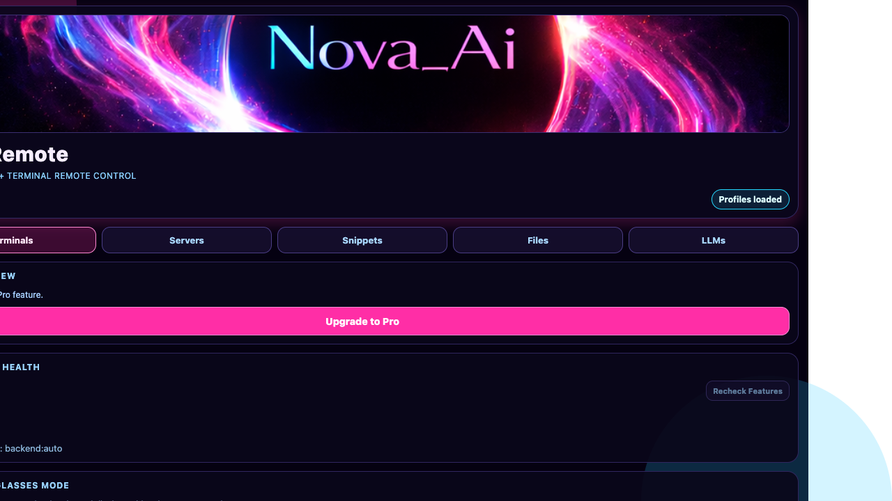
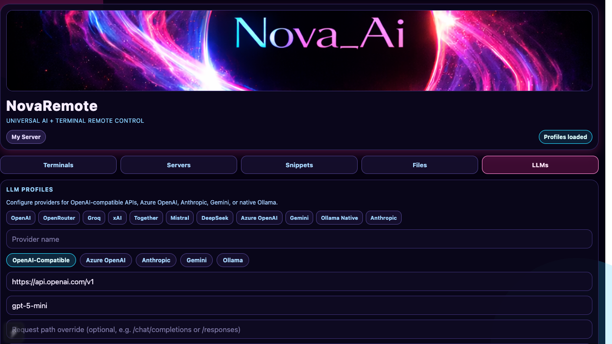
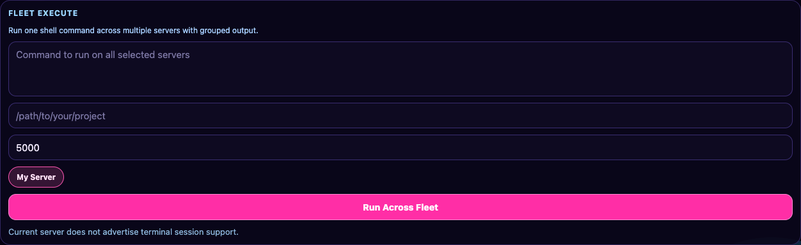
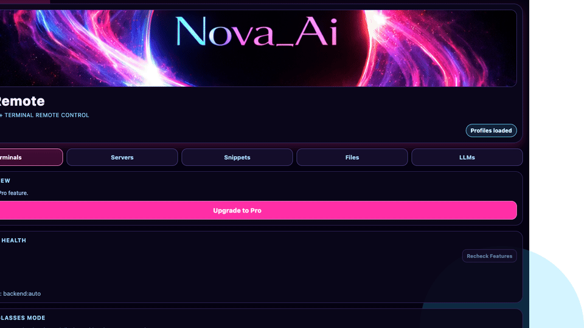
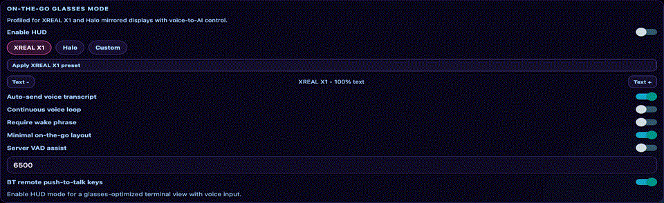

# NovaRemote

NovaRemote is an Expo + React Native app for controlling remote terminal and AI sessions through a companion server.

## Why NovaRemote

- Mobile-first remote terminal + AI workflow for homelabs, devops, and remote coding
- Companion-server model (no raw SSH credentials stored in app)
- Fleet operations, watch alerts, AI routing, and glass-friendly on-the-go mode

## Demo / Screens

Drop screenshots/GIFs into `docs/media/` and wire them here:









Use `docs/media/README.md` as the canonical media file map.

## Demo Videos

- `Demo 1 (20-40s)`: terminal streaming + ANSI + search
- `Demo 2 (20-40s)`: AI suggestion/error triage + fleet execute
- Keep one public launch link (YouTube/X) in this section once recorded

## Features

- Multi-server profiles with secure storage
- AI and shell session control
- Live terminal streaming + polling fallback
- ANSI color rendering
- Command history (per server/session, persisted)
- Session tags + tag filtering
- Fullscreen terminal search (highlighted matches)
- Snippets/macros (Pro)
- Remote file explorer (list/read/tail, inline edit/save-upload, and path-to-terminal actions)
- Capability detection per server (terminal API family, codex/files/shell/mac-attach)
- Cached capability detection (memory + encrypted storage) for faster reconnect/startup
- Server backend metadata per profile (auto/tmux/screen/zellij/powershell/cmd/pty)
- Universal terminal transport (`/tmux/*` legacy or `/terminal/*` provider-agnostic)
- External LLM profiles (OpenAI-compatible, first-class Azure OpenAI, Anthropic, Gemini, Ollama + preset shortcuts for OpenRouter/Groq/xAI/Together/Mistral/DeepSeek)
- Advanced OpenAI-compatible profile controls (custom request path + custom headers)
- LLM provider test diagnostics (latency + explicit failure output)
- LLM advanced test harness (vision image URL + built-in tool-calling + tool-context payload)
- Per-session AI engine routing (auto/server/external)
- Local AI sessions powered directly by configured external LLMs
- Encrypted LLM profile export/import with passphrase
- AI shell command suggestions based on output + history context
- Watch mode with regex-based alert notifications
- Fleet mode (run one shell command across selected servers)
- Configurable fleet wait timeout
- Per-server configurable shell-run wait timeout for command sends
- Biometric app unlock (Face ID / Touch ID)
- Optional dangerous-command confirmation guardrail
- Session export (shareable JSON with command history + output)
- Pull-to-refresh + connection health metrics
- First-run in-app tutorial overlay
- Shareable server config links/QR (token excluded)
- Direct SSH fallback launcher via `ssh://` (optional per-server host/user/port)
- Snippet/macros JSON export/import for manual cloud sync
- Anonymous analytics telemetry (opt-in toggle)
- Referral program scaffold (share + claim code links)
- Pro team shared profile templates (export/import/apply, token-free)
- iPad split-view layout (Pro)
- RevenueCat paywall scaffolding (free tier: 1 server, 2 sessions)
- Onboarding wizard with connection test
- App-level React error boundary with recovery UI

## Companion Server

NovaRemote requires a companion backend. API contracts and auth are documented in `docs/SERVER_SETUP.md`.

For adoption/migration guidance (including a Docker-first path for a reference server), see:

- `docs/REFERENCE_SERVER.md`

Target public one-liner once the reference server image is published:

```bash
docker run --rm -p 8787:8787 -e NOVA_TOKEN=change-me ghcr.io/maddwiz/codex-remote:latest
```

## Requirements

- Companion API server (see `docs/SERVER_SETUP.md`)
- Expo SDK 55 environment

## Local Run

```bash
cd /path/to/NovaRemote
npm install
npm run start
```

## Quality Gates

- Typecheck: `npm run typecheck`
- Unit tests: `npm run test`
- Expo doctor: `npm run doctor`
- Full local CI pass: `npm run ci`

GitHub Actions CI is configured in `.github/workflows/ci.yml`.

## Optional Environment Variables

RevenueCat is optional in development. To enable purchase flows:

- `EXPO_PUBLIC_REVENUECAT_API_KEY_IOS`
- `EXPO_PUBLIC_REVENUECAT_API_KEY_ANDROID`

Without these keys, paywall UI still renders but purchasing/restoring is disabled.

## Pricing Notes

Recommended structure for indie/mobile-devops audience:

- Free: `1` server + `2` open sessions
- Pro subscription: monthly + yearly plans
- Optional lifetime offer for early adopters

Set these offerings in App Store Connect + RevenueCat (entitlement `pro`).

## Companion Server Setup

See `docs/SERVER_SETUP.md` for endpoint contracts and auth requirements.

Cross-platform ecosystem/install guide:

- `docs/ECOSYSTEM.md`
- `docs/MONETIZATION_SCALE.md`

## App Store / Launch Checklist

See `docs/APP_STORE_PREP.md`.

Google Play checklist:

- `docs/PLAY_STORE_PREP.md`
- `docs/PRIVACY_POLICY.md`
- `docs/TERMS_OF_SERVICE.md`
